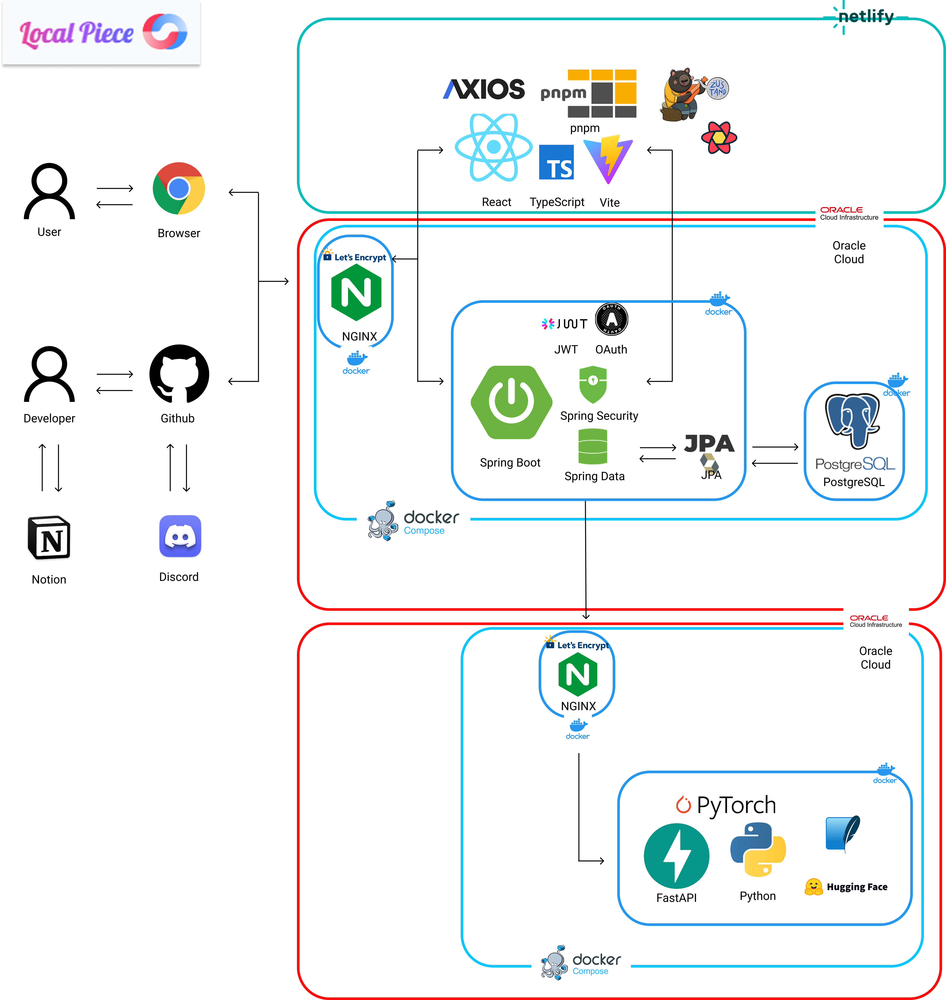

# 🧩 LocalPiece

> **경상북도 공공데이터 기반 AI 여행 일정 자동 생성 & 블로그 자동 기록 플랫폼**

---

## 📑 목차

1. [📋 프로젝트 소개](#-프로젝트-소개)
2. [🚀 주요 기능](#-주요-기능)
3. [🛠️ 기술 스택](#-기술-스택)
4. [📂 프로젝트 구조](#-프로젝트-구조)
5. [👨‍👩‍👧‍👦 팀원 정보](#-팀원-정보)
6. [🔧 담당 파트](#-담당-파트)
7. [🧩 기능 시연](#-기능-시연)
8. [📌 산출물](#-산출물)

---

## 📋 프로젝트 소개

> **여행 루트 생성부터 블로그 기록까지, 단 한 번의 클릭으로 완성되는 AI 여행 서비스**

- 경상북도 공공데이터 기반 여행지 데이터 활용
- AI가 여행 목적·분위기·동행자 정보를 기반으로 맞춤형 일정 생성
- 여행 후 방문지를 기반으로 블로그 자동 작성
- 여행지를 수집하며 “여행 퍼즐(Piece)”을 완성하는 게이미피케이션 시스템 제공

---

## 🚀 주요 기능

1. **AI 여행 일정 생성** — 사용자 입력 기반 맞춤형 여행 루트 추천
2. **AI 블로그 자동 생성** — 방문지 및 이미지 기반 포스트 자동 작성
3. **여행 조각(Piece) 시스템** — 수집형 퍼즐 진척도 시각화
4. **여행지 목록 및 상세 페이지** — 관광/맛집/체험 등 카테고리별 검색
5. **마이페이지** — 나의 코스, 블로그, 조각 관리
6. **반응형 UI** — 모든 기기에서 최적화된 화면 구성

---

## 🛠️ 기술 스택

### 💻 프론트엔드


---

### ⚙️ 백엔드


---

### 🧠 AI


---

### 🗄️ 데이터베이스


---

### ☁️ 인프라 & 배포


---

### 👊 협업 도구


---

### ✍️ IDE


---

## 📂 프로젝트 구조

### 📊 아키텍처 구조



### 📦 프론트엔드

```bash
src/
├── api/                #Axios 기반 API 모듈
├── assets/             # 이미지 및 정적 리소스
├── common/             # 공통 유틸리티 및 컴포넌트
├── components/
│   ├── aitravel/       # AI 여행 코스 관련 UI
│   ├── blog/           # 블로그 관련 컴포넌트
│   ├── pieces/         # 여행 조각 시스템 UI
│   ├── home/           # 홈/메인 페이지 UI
│   ├── share/          # 공용 모달, 버튼 등 재사용 컴포넌트
│   └── tour/           # 여행지 상세/리스트 UI
├── constants/          # 카테고리 및 상수 정의
├── layout/             # 전체 페이지 레이아웃
├── pages/              # 라우팅 페이지
├── router/             # React Router 설정
├── store/              # Zustand 상태 관리
├── types/              # TypeScript 타입 정의
└── main.tsx            # 진입점
```

### 🖥️ 백엔드

1. Spring Boot

```bash
com.flowerguys.localpiece
├── global             # 전역 설정 (config, exception, security 등)
├── user               # 사용자 도메인
│   ├── controller
│   ├── service
│   ├── entity
│   ├── repository
│   └── dto
├── post               # 게시물 도메인
│   └── ...
├── comment            # 댓글 도메인
│   └── ...
└── ...

```

2. FastAPI

```bash
AI/
├── app/
│   ├── main.py              # FastAPI 서버 진입점
│   └── routers/
│       └── blog_router.py   # 블로그 생성 요청 핸들러
│
├── ai_modules/
│   ├── main_blip.py         # 핵심 분석 파이프라인 (YOLO, Places, BLIP)
│   └── places/
│       ├── resnet18_places365.pth.tar         # pretrained weight
│       └── categories_places365.txt           # 장소 클래스 리스트
│
├── blog_generator.py        # 블로그 문장 생성기
└── requirements.txt         # 전체 dependency 목록
```

---

## 👨‍👩‍👧‍👦 팀원 정보

|    이름    |            역할             |                  GitHub                  |         이메일         |
| :--------: | :-------------------------: | :--------------------------------------: | :--------------------: |
| **정민규** | 팀장 / 인프라 / AI / 백엔드 |  [GitHub](https://github.com/Chungmingyu)  |    ktfigs@gmail.com    |
| **임재열** |  프론트엔드 / AI / 백엔드   | [GitHub](https://github.com/JYeol97) | a01092201761@gmail.com |
| **우준규** |         프론트엔드          |    |                        |
| **송주헌** |    백엔드 / 데이터베이스    |    |                        |

---

## 🔧 담당 파트

### 정민규

### 임재열

- **프론트엔드 전체 설계 및 개발**

  - React + TypeScript 기반 구조 설계
  - Zustand 전역 상태관리 및 Axios 인터셉터 구성
  - TailwindCSS로 반응형 UI 구축

- **AI 기능 연동 (블로그 자동 작성)**

  - Tiptap 기반 에디터를 활용한 AI 블로그 자동 작성 기능 구현
  - AI 생성 API 파라미터 처리 및 결과 렌더링 로직 구현
  - 이미지 업로드 및 텍스트/이미지 혼합 콘텐츠 직렬화 처리

- **백엔드 기능 구현 (Spring Boot)**

  - 회원 CRUD 기능 개발 (회원가입, 로그인, 수정, 삭제)
  - JWT 기반 인증 및 BCrypt 비밀번호 암호화 적용
  - `/api/users/` 통일된 REST API 구조 설계

- **UX/UI**

  - Framer Motion + Lottie로 인터랙션 구현
  - Toast 알림, Skeleton UI 등 사용자 경험 개선

- **지도 및 시각화**
  - Google Maps API 기반 여행 루트 시각화
  - 마커·경로·거리 계산 등 기능 구현

### 우준규

### 송주헌

---

## 🧩 기능 시연

---

## 🎯 AI 여행 일정 기능

### 🗺️ AI 여행 일정 생성
<video src="image/tourCreate.gif" controls width="600"></video>

### 🔍 여행지 상세 조회
<video src="image/tourGet.gif" controls width="600"></video>

### 📋 여행지 리스트 조회
<video src="image/tourList.gif" controls width="600"></video>

---

## ✏️ AI 블로그 자동 생성

### 🖼️ 블로그 자동 생성 (AI 분석)
<video src="image/blogGenerate.gif" controls width="600"></video>

### 📝 블로그 직접 작성
<video src="image/blogCreate.gif" controls width="600"></video>

### 📚 블로그 리스트 조회
<video src="image/blogList.gif" controls width="600"></video>

---

## 👤 마이페이지

### 🙋‍♂️ 마이페이지 전체 기능
<video src="image/myPage.gif" controls width="600"></video>

---

## 📌 산출물

### 🧱 ERD


### 📜 API 명세서

🔗 [LocalPiece API 문서 (Notion)](https://min9yu.notion.site/API-21a3147c29e080658b98f44de740ec88?source=copy_link)

### 🌐 배포 링크

🔗 [https://localpiece.netlify.app/](https://localpiece.netlify.app/)

---

## 🏁 요약

> **LocalPiece**는 “공공데이터 × AI × UX”의 결합을 통해  
> 여행의 시작부터 기록까지 완전 자동화한 **AI 여행 플랫폼**입니다.
